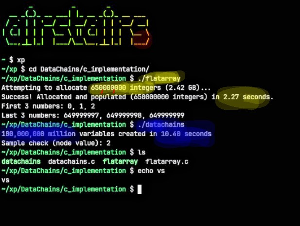
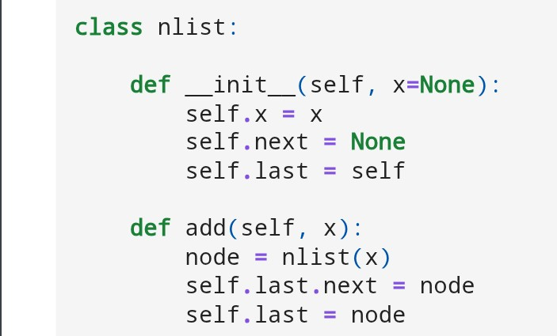
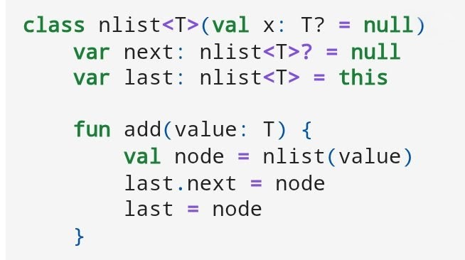

# DataChains  
## aka Python Lists for any Programming language    

   

  

[300 million](https://colab.research.google.com/drive/1RILYOwOIwzt5pVTLRNWA35VxCEEyLLpl?usp=sharing)

[click me](Untitled.ipynb)

  

   

  

[latest version](test/makesmaller-again.ipynb)  

[kotlin version](test/kotlinvers-make-smalleragain.ipynb)
